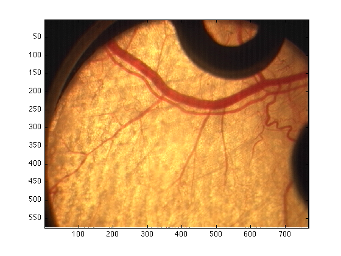
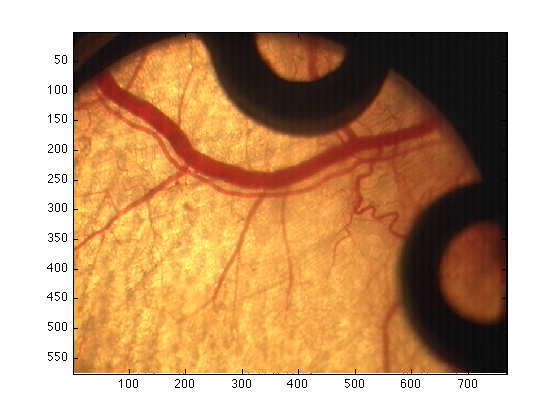
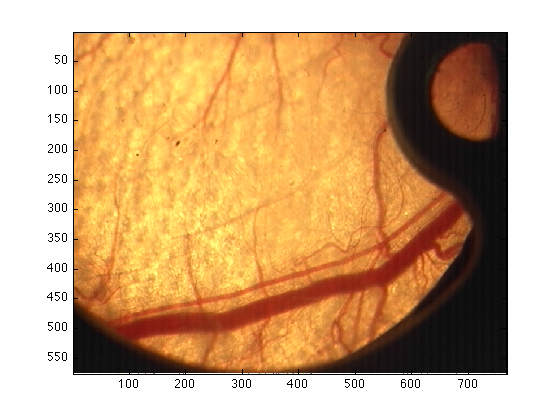
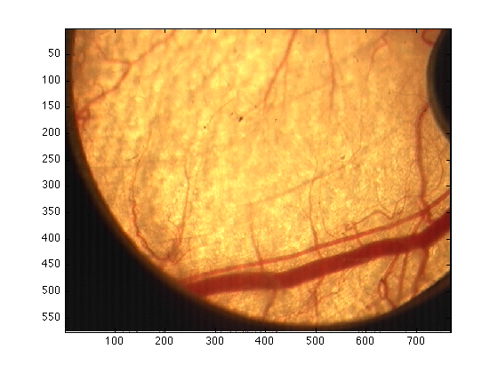
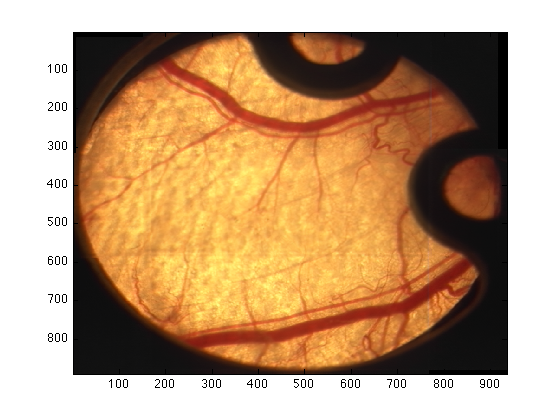

# Stitch-Images
Matlab Routines to stitch four images (Quadrants)

A longer description of the algorithm including intermediate steps can be found in the book:

 <a href="http://onlinelibrary.wiley.com/book/10.1002/9781118657546">
  Biomedical image analysis recipes in MATLAB: for life scientists and engineers</a>,  
CC Reyes-Aldasoro 
John Wiley & Sons.

 
<h1>User Manual for stitch4Images</h1><!--introduction--><!--/introduction-->
<h2>Introduction</h2>

In some cases, you might not be able to capture the whole region of
interest using the x2.5 magnification objective of the microscopes. It
is possible to "stitch" four images together in Matlab. For more than 4
images there are commercial software packages that can be downloaded for
free. This manual describes how to stitch 4 images into a single one.

          <h2>Loading the data into Matlab</h2>

As always, you need to load the data into matlab, either by using imread or drag-and-drop. Refer to other manuals for more details. In this case, I will load them using imread:

<pre class="codeinput">quadrant1=imread('Q1.bmp');
quadrant2=imread('Q2.bmp');
quadrant3=imread('Q3.bmp');
quadrant4=imread('Q4.bmp');

figure(1)
imagesc(quadrant1)
figure(2)
imagesc(quadrant2)
figure(3)
imagesc(quadrant3)
figure(4)
imagesc(quadrant4)
</pre>

The order in which the images must be presented to the algorithm is the following: 1 : top - left, 2 : top - right, 3 : bottom - left, 4 : bottom - right.

<h2>Running the algorithm</h2>

To obtanined the stitched version of the image simply type:
<pre class="codeinput">completeImage = stitch4Images(quadrant1,quadrant2,quadrant3,quadrant4);
</pre>

And to visualise it:
<pre class="codeinput">figure(5)
imagesc(completeImage/255)
</pre>

The 255 is used as the output is a "double".

<h2>Saving</h2>

To save your image, you can simply click on the "edit" menu from the figure, the go to "copy" and then you can "paste" it in word, powerpoint, ... You can also click on "File" then "Save" and select the name (e.g. "myFabulousImage.jpg") and the format (jpg,tif,bmp,...) you prefer.

<pre class="codeinput">%or save it as a matlab file in the following way:

save myFabuolusImage completeImage
</pre>

This last file will save the data of "completeImage" inside the file myFabulousImage. You can save more things there, for instance
<pre class="codeinput">save myFabuolusImage completeImage quadrant1 quadrant2 quadrant3 quadrant4
</pre>
will save all the quadrants and the results.

